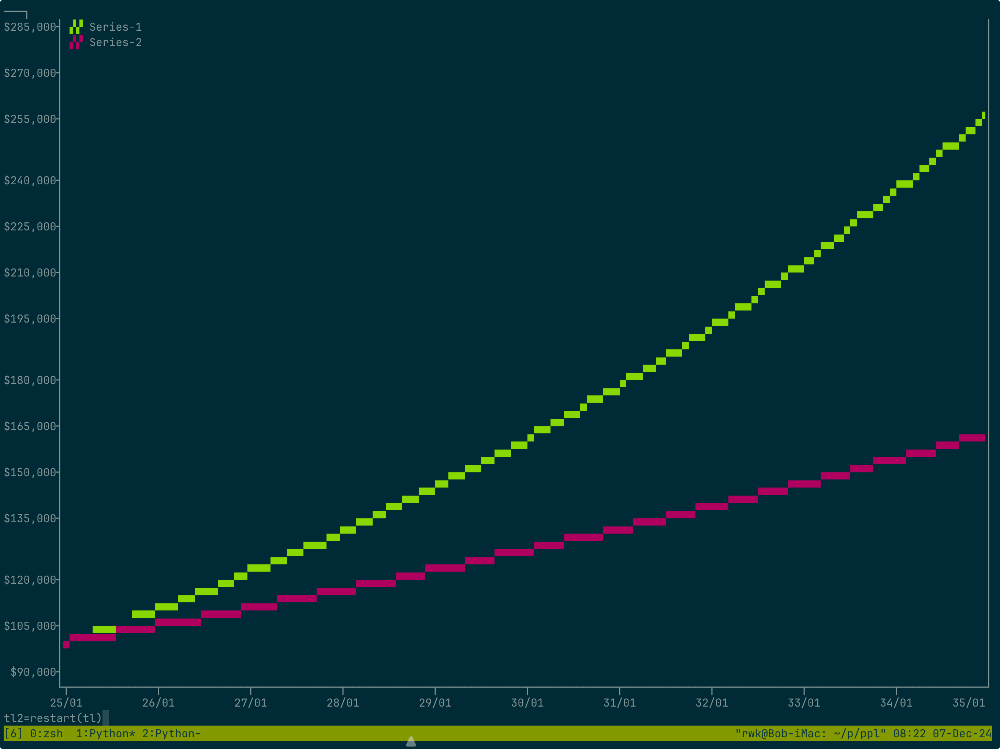

# Setting up to explore

## A note about intent

Our initial goal is to help understand the principles behind how paying off the mortgage would affect our finances. Let me emphasize:

_Understand the principles_.

The _initial_ goal is _not_ to understand the specifics of our financial situation. That requires considerably more detail, which we should get to.

BUT IT IS NOT WHERE TO START!

Diving into out situation right away will result in endless discussions and no progress.

Treating it a programming exercise won't work, either. You need to understand the problem before you can program it.

It still covers a number of topics:

* Investment income
* Loan interest vs principal
* Marginal tax rates and tax caps
* Inflation

Each of these interact with the mortgage tradeoff. Once we can demonstrate the nature of those interactions, we will be ready to tackle the details.

## Install direnv

Not essential, but it will save you trouble.

```bash
port install direnv
```

## Clone this repo on GitHub

* Create it on the github web UI
* Copy the URL to your new repository
* Clone it locally:

```bash
git clone <url>
cd <project_name>
```

## Create a virtual environment

```bash
python3 -m venv .venv
source .venv/bin/activate
```

## What is here so far

There are some basic pieces here so we can quickly dive into conceptual exploration.

This project has a number of useful tools that will let us explore without getting stuck on complex programming tasks, such as plotting. There are three main areas:

* Compound interest rate calculations. These aren't useful for the main task, because they assume a constant situation (i.e. no payments, withdrawals, etc.). But they're useful for doing quick estimates, and to verify the main simulation. For example, if the only changes to an account are interest, these functions and simulation should produce the same result.

* Generator/Timeline utilities. These form the heart of the engine. Accounts generate their monthly state, and the timeline collect these states, generating a monthly snapshot. It's not a complete implementation of the simulation steps—I saved some for you. But it's enough to see how the system needs to work.

* Time-series plotting and tables. These work in terminal windows, and make it easy to understand the results.

```text
@ table(tl)
Month Mortgage  Fidelity
----- --------- ---------
25/01 $-100,000 $ 100,000
25/02 $-100,315 $ 100,797
25/03 $-100,631 $ 101,601
25/04 $-100,948 $ 102,411
25/05 $-101,267 $ 103,228
25/06 $-101,586 $ 104,051
25/07 $-101,906 $ 104,880
25/08 $-102,228 $ 105,717
25/09 $-102,550 $ 106,560
25/10 $-102,873 $ 107,409
25/11 $-103,198 $ 108,266
25/12 $-103,523 $ 109,129
```



## Theory of operation

The basic concepts should be familiar:

* _Accounts_: We divide these into assets (+ value) and liabilities (- value). It's possible for an asset to become temporarily negative or a liability to become positive, but we usually won't reclassify them if this happens.

* _Transactions_: These change the value of an account by transferring money between accounts. (An account may be external, such as an income source or an expense category).

* _Events_: These may also change the value of an account, but we don't model these as transactions. An example would be interest earned in an account.

* _Schedule_: A table (a _heap_ data structure) of transactions and events, both scheduled and one-time.

To start, we won't bother with using the schedule or regular events such as interest.  Rather, we can just let the individual accounts update themselves.

For example, we can model an interest-bearing (or interest-charging) account like this:

```python
def interest(principle: float,interest: float):
      monthly = 1 + monthly_rate(interest/100)
      while True:
          yield principle
          principle = principle * monthly
```

A timeline combines the accounts:

```python
A = interest(100000, monthly_rate(0.10))
M = interest(-100000, monthly_rate(0.0385))
tl = timeline(Mortgage=M, Fidelity=A)
```

(By default, a timeline starts at the beginning of the next month, but series of monthly dates is always a part of a timeline)
