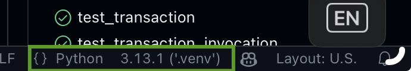

# Setting up to explore

## Install direnv

Not essential, but it will save you trouble.

```bash
port install direnv
```

## Clone this repo on GitHub

* Create it on the github web UI
* Copy the URL to your new repository
* Clone it locally:

```bash
git clone <url>
cd <project_name>
```

## Install python 3.13

3.10 is near end-of-life. 3.11 is security-patch-only.

Installing 3.13 will not uninstall or replace earlier versions.

## Install `uv`

```bash
pip install -c constraints.txt uv
```

`uv` replaces `pip` and `poetry`. It is MUCH faster and has other advantages as well.

## Set up virtual environment and install dependencies

```bash
cd pplt
uv sync
source .venv/bin/activate
```

(That's it. `uv sync` creates the virtual environment as well as installing
dependencies).

## Set up VS Code

The Python extension version 2024.22.1 has a new bug that breaks test discovery (it hangs forever). Until it is fixed, we need to downgrade to 2024.22.0, or upgrade to the pre-release version.

[Instructions can be found here.](https://github.com/microsoft/vscode-python/issues/24656#issuecomment-2561238479)

You will need to be sure VSCode is using the virtual environment. If not, click on the enviornment shown when viewing any python file, and select it.



## What is here so far

There are some basic pieces here so we can quickly dive into conceptual exploration.

This project has a number of useful tools that will let us explore without getting stuck on complex programming tasks, such as plotting. There are three main areas:

* Compound interest rate calculations. These aren't useful for the main task, because they assume a constant situation (i.e. no payments, withdrawals, etc.). But they're useful for doing quick estimates, and to verify the main simulation. For example, if the only changes to an account are interest, these functions and simulation should produce the same result.

* Generator/Timeline utilities. These form the heart of the engine. Accounts generate their monthly state, and the timeline collect these states, generating a monthly snapshot. It's not a complete implementation of the simulation steps—I saved some for you. But it's enough to see how the system needs to work.

* Scenario files. A scenario file defines a set of accounts and events/transactions on those accounts. It is a YAML file; a loadable example is in [data.yml](data.yml).

* Time-series plotting and tables. These work in terminal windows, and make it easy to understand the results.

```text
@ table(tl)
Month Mortgage  Fidelity
----- --------- ---------
25/01 $-100,000 $ 100,000
25/02 $-100,315 $ 100,797
25/03 $-100,631 $ 101,601
25/04 $-100,948 $ 102,411
25/05 $-101,267 $ 103,228
25/06 $-101,586 $ 104,051
25/07 $-101,906 $ 104,880
25/08 $-102,228 $ 105,717
25/09 $-102,550 $ 106,560
25/10 $-102,873 $ 107,409
25/11 $-103,198 $ 108,266
25/12 $-103,523 $ 109,129
```


You can do `_.next` to access the next increment of a table.

Other tables:

```python
tl.schedule.table
```

This shows the scheduled events and transactions.

```python
tl.transaction_table()
```

This shows the individual events and transactions over time. You can supply `end=`_n_ to indicate the table should end after _n_ months. You can filter with `accounts=` and `handlers=` arguments to make it easier to look at the operations on a subset of accounts or event/transaction handlers.

## Theory of operation

The basic concepts should be familiar:

* _Accounts_: We divide these into assets (+ value) and liabilities (- value). It's possible for an asset to become temporarily negative or a liability to become positive, but we usually won't reclassify them if this happens.

* _Transactions_: These change the value of an account by transferring money between accounts. (An account may be external, such as an income source or an expense category).

* _Events_: These may also change the value of an account, but we don't model these as transactions. An example would be interest earned in an account.

* _Schedule_: A table (a _heap_ data structure) of transactions and events, both scheduled and one-time.

To start, we won't bother with using the schedule or regular events such as interest.  Rather, we can just let the individual accounts update themselves.

For example, we could model an interest-bearing (or interest-charging) account like this:

```python
def interest_account(principle: float,interest: float):
      monthly = 1 + monthly_rate(interest/100)
      while True:
          yield principle
          principle = principle * monthly
```

A timeline combines the accounts:

```python
A = interest_account(100000, monthly_rate(0.10))
M = interest_account(-100000, monthly_rate(0.0385))
tl = timeline(Mortgage=M, Fidelity=A)
```

(By default, a timeline starts at the beginning of the next month, but series of monthly dates is always a part of a timeline)

This isn't quite how we do it, however; this is a bit too inflexible. Instead, we separate the updates from the accounts, and move them to the _schedule_.

For experimenting, we can use a shortcut to creating an account, and just supply an initial balance:

```python
tl = timeline(Mortgage=-100000, Fidelity=100000)
tl.schedule.add(interest('Mortgage', rate=0.0385, period=(1, 'month')))
tl.schedule.add(interest('Fidelity', rate=0.10, period=(1, 'month')))
tl.schedule.add(transaction('Fidelity', 'Mortgage', amount=1000, period=(1, 'month')))
```
